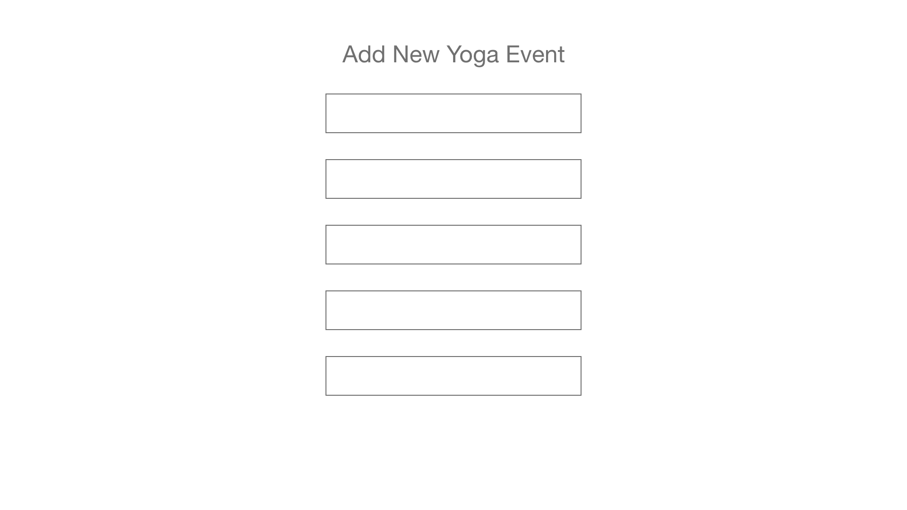
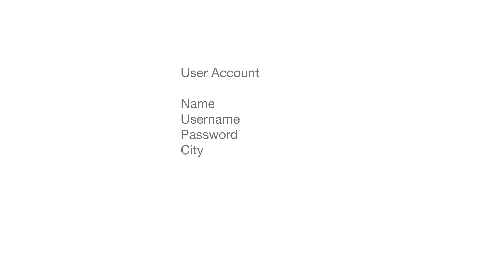
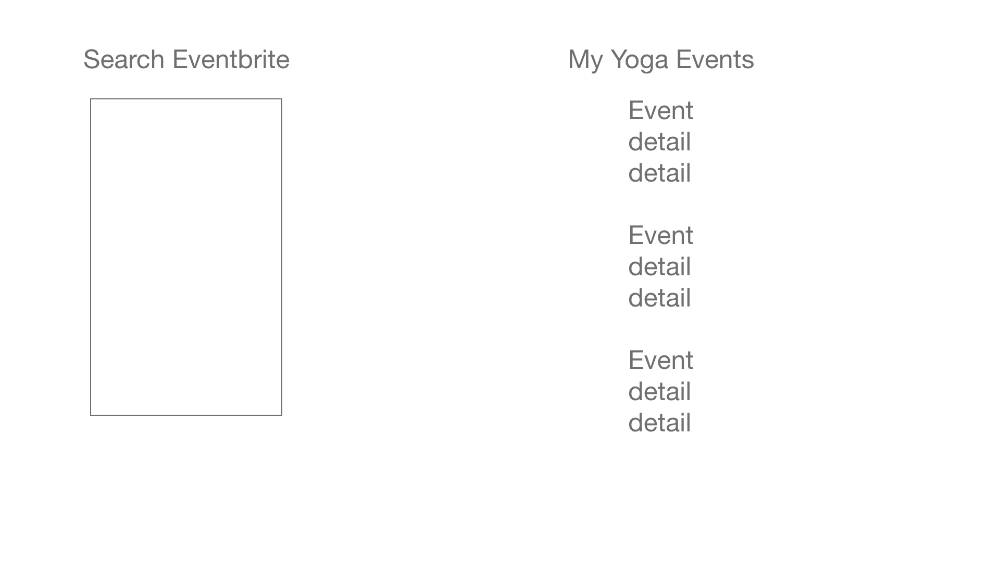
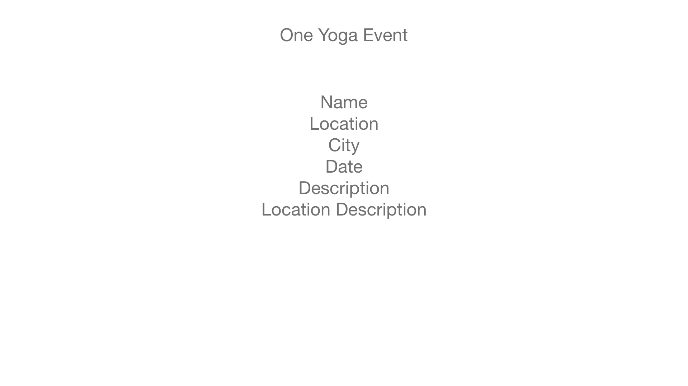
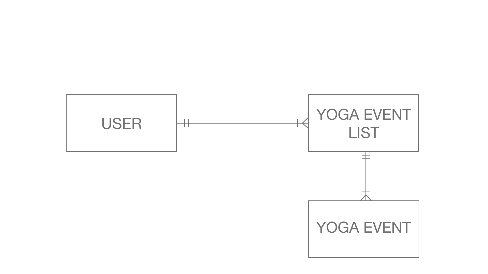

# SEI 22 PROJECT 4: AJAR YOGA

* To Do: develop a full MERN stack application integrating databases and working with MVC architechture

* Languages: HTML, CSS, JavaScript

* Stack: Mongo, Express, React, Node

* Libraries: MaterialUI

[GitHub](https://github.com/racheltezza/project4-yoga "My gitHub repo")

[Project](https://quiet-falls-54203.herokuapp.com/ "My deployed site")

[Trello](https://trello.com/b/8sl2Onfp/sei-22-project-4 "My Trello board")

#### Wireframes
   

#### ERD

### Future Goals

* User login authentication
* Ability for users to add searched events to event list with one click

